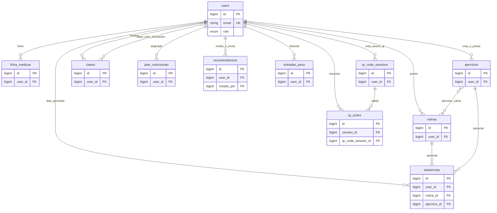
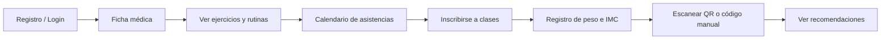
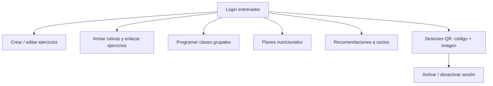
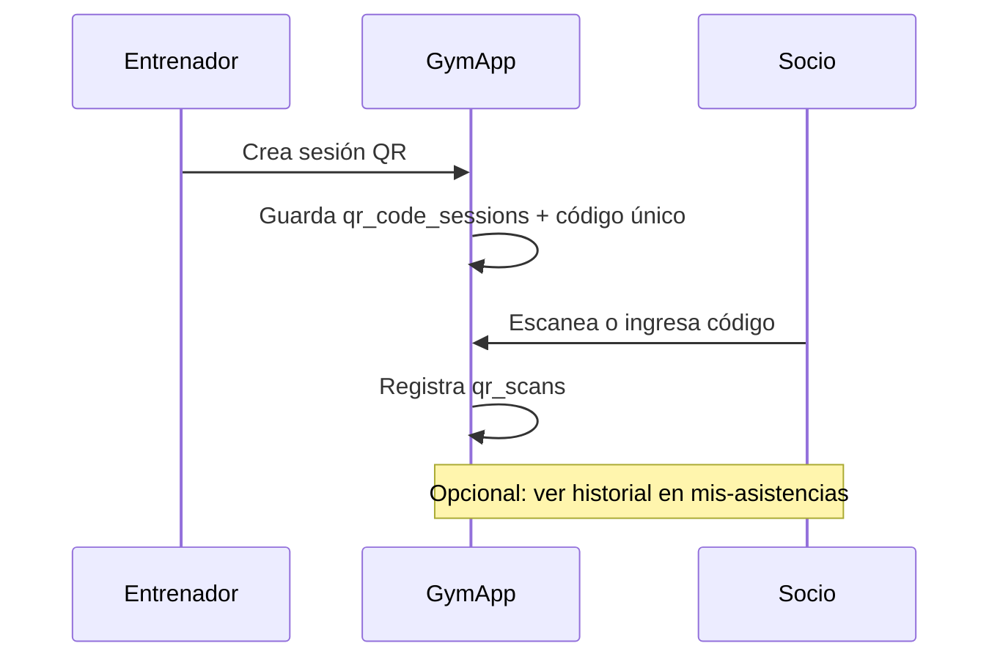

# GymApp

Aplicación web para la gestión de un gimnasio: usuarios con distintos perfiles, fichas médicas, ejercicios y rutinas, planes nutricionales, clases grupales, seguimiento de asistencia (calendario y QR), control de peso e IMC, y recomendaciones del entrenador.

**Stack:** Laravel 10, PHP 8.1+, Breeze (autenticación), Sanctum, Spatie Laravel Permission, generación de códigos QR.

---

## Cómo leer este documento

1. **Mapa de relaciones** — Cómo se conectan las tablas entre sí (diagrama).
2. **Historias en flujo** — Qué hace cada tipo de usuario, paso a paso.
3. **Casos de uso por “zona” del sistema** — Más visual que una lista plana.
4. **Detalle por tabla** — Referencia rápida al final.

---

## Roles (actores)

| Rol | En una frase |
|-----|----------------|
| **Socio** (`usuario`) | Entrena, se inscribe a clases, registra peso y asistencia, usa QR. |
| **Entrenador** (`entrenador`) | Crea contenido (ejercicios, rutinas, clases, planes, QR) y orienta al socio. |
| **Superadmin** (`superadmin`) | Mismo eje que entrenador en varios módulos; permisos ampliados donde la app lo define. |

El acceso HTTP se filtra con el middleware `CheckRole` (campo `role` en `users`). Spatie Permission añade tablas extra para roles/permisos granulares si los usas en código.

---

## Mapa visual: cómo se relacionan las tablas

El **usuario** (`users`) es el centro: casi todo “cuelga” de él. Las líneas indican relaciones lógicas (FK o pivotes).



> **Nota:** En `recomendacions`, **`user_id`** es el socio que recibe el mensaje y **`creado_por`** es otro `users` (entrenador/admin) que lo escribe. La arista única hacia `users` en el diagrama resume esas dos FK.

**Lectura rápida:**

| Relación | Significado |
|----------|-------------|
| `users` → `ficha_medicas`, `entradas_peso`, … | Datos del **mismo socio** (salud, peso, asistencias). |
| `users` → `clases` (como FK en `clases`) | El **entrenador** que crea la clase grupal. |
| `clase_user` | Une **socios** con **clases** (muchos a muchos). |
| `ejercicio_rutina` | Une **ejercicios** con **rutinas** (muchos a muchos). |
| `recomendacions` | Dos FK a `users`: **quién recibe** y **quién escribe**. |
| `asistencias` | Puede apuntar opcionalmente a **rutina** y/o **ejercicio** ese día. |
| `qr_scans` | Conecta **socio** + **sesión QR** creada por entrenador. |

---

## Historias en flujo (casos de uso como recorrido)

### Socio: del registro al entrenamiento



### Entrenador: preparar el gimnasio digital



### Asistencia con QR (idea general)



---

## Casos de uso por “zona” (vista creativa)

Cada bloque agrupa **qué problema resuelve** en el mundo real.

### Zona identidad y acceso

```
┌─────────────────────────────────────────────────────────┐
│  USUARIO ENTRA AL SISTEMA                                │
│  • Cuenta (users) + recuperación de clave                │
│    (password_reset_tokens)                               │
│  • Tokens API opcionales (personal_access_tokens)        │
└─────────────────────────────────────────────────────────┘
```

### Zona salud y seguimiento físico

```
   [ficha_medicas]          [entradas_peso]
         │                         │
         │    historial médico     │    peso, altura, IMC
         └───────────┬─────────────┘
                     ▼
              mismo user_id (users)
```

### Zona entrenamiento (catálogo + plan)

- **`ejercicios`** — Biblioteca de movimientos (dificultad, series, multimedia).
- **`rutinas`** — Programa por días/fechas/objetivo.
- **`ejercicio_rutina`** — “Esta rutina lleva estos ejercicios” (N:M).

### Zona grupo y comunidad

- **`clases`** — Evento en fecha/hora con cupo.
- **`clase_user`** — “Yo me apunto a esta clase”.

### Zona coaching

- **`plan_nutricionals`** — Calorías y pautas por socio.
- **`recomendacions`** — Mensaje de entrenador/admin → socio (con autor y fecha).

### Zona presencia (doble canal)

| Canal | Tabla principal | Idea |
|-------|-----------------|------|
| Calendario manual | `asistencias` | Marca día; puede ligar rutina/ejercicio. |
| QR en sala | `qr_code_sessions` + `qr_scans` | Sesión creada por entrenador; el socio valida con código. |

### Zona permisos avanzados (Spatie)

Tablas `permissions`, `roles`, `model_has_*`, `role_has_permissions`: modelo **rol + permiso** del paquete, útil si amplías reglas más allá del enum `role` en `users`.

### Zona sistema (cola)

- **`failed_jobs`** — Depuración de trabajos en cola que fallaron.

---

## Referencia por tabla (detalle)

| Tabla | Casos de uso típicos |
|-------|----------------------|
| `users` | Alta, login, rol, dueño de casi todos los registros del socio o del entrenador. |
| `password_reset_tokens` | Flujo “olvidé mi contraseña”. |
| `failed_jobs` | Inspección de errores en colas. |
| `personal_access_tokens` | Autenticación API con Sanctum. |
| `ficha_medicas` | Datos personales y antecedentes para entrenar con seguridad. |
| `ejercicios` | CRUD de movimientos; se enlazan a rutinas vía pivote. |
| `rutinas` | Programas con días JSON, fechas, estado, objetivo. |
| `ejercicio_rutina` | Composición N:M rutina ↔ ejercicio. |
| `clases` | Clases grupales creadas por entrenador (`user_id`). |
| `clase_user` | Inscripción N:M usuario ↔ clase. |
| `plan_nutricionals` | Plan nutricional por `user_id`. |
| `recomendacions` | Mensaje a `user_id` desde `creado_por`. |
| `asistencias` | Un registro por día y usuario; FK opcionales a rutina/ejercicio. |
| `entradas_peso` | Evolución de peso, IMC y clasificación. |
| `qr_code_sessions` | Sesión con código único e imagen QR (entrenador). |
| `qr_scans` | Confirmación de asistencia vinculada a sesión y usuario. |
| Spatie (`permissions`, `roles`, …) | Permisos y roles a nivel de paquete sobre modelos. |

---

## Requisitos e instalación (resumen)

- PHP ≥ 8.1, Composer, extensiones habituales de Laravel.
- Copiar `.env`, configurar base de datos y ejecutar `php artisan migrate` (y seeders si aplica).
- `php artisan key:generate` y `php artisan serve` para desarrollo.

Más detalle en la [documentación de Laravel](https://laravel.com/docs).

## Licencia

El framework Laravel se publica bajo la [licencia MIT](https://opensource.org/licenses/MIT).
